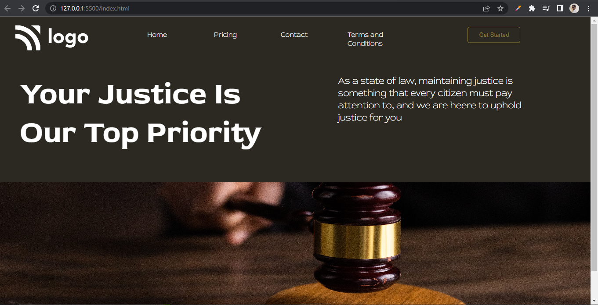

# Assignment 3

## Project 3 [Live Link](https://nachiketkeripaleproject3.netlify.app/)

-   Created this project from scratch. 
-   Got cleared about the importance for the class and how we can traget the element 
-   Learn to use background property transparent for button. 

---

## Time taken to finish this project

-   3 hour to complete it.

#### Screenshot

 

